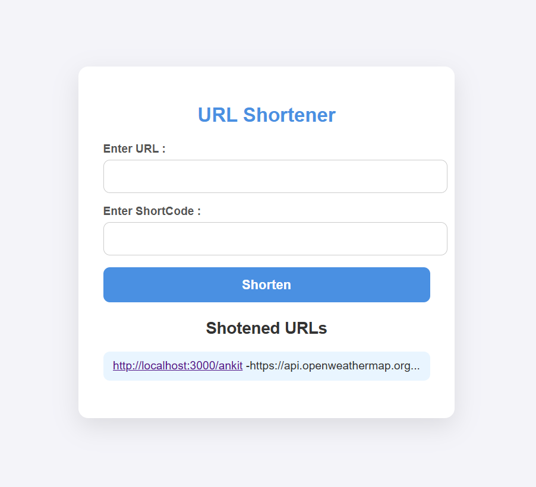

<h1>URL Shortener</h1>

<h2>
  
  
  Features</h2>
<ul>
    <li>Shorten long URLs</li>
    <li>Redirect to original URLs using short links</li>
    <li>Simple front-end interface for users</li>
    <li>Store shortened URLs in memory or a file</li>
    <li>Unique short URL generation</li>
</ul>

<h2>Installation</h2>
<h3>Prerequisites</h3>

Make sure you have Node.js installed on your system.

<h3>Steps</h3>
<ol>
    <li>Clone the repository:
        <pre><code>git clone &lt;https://github.com/ankit-4623/shorten_url.git&gt;
        
        
        <h2>cd shorten_url_project

Install dependencies:
npm install

Start the server:
node server.js

Open http://localhost:3000 in your browser.</h2>
<ol>
    <li>Enter a long URL in the input field.</li>
    <li>Click "Shorten".</li>
    <li>Copy the generated short URL and use it to access the original link.</li>
</ol>

<h2>Technologies Used</h2>
<ul>
    <li>Node.js</li>
    <li>HTML</li>
    <li>CSS</li>
</ul>

<h2>License</h2>

This project is licensed under the MIT License.

<h2>Contributing</h2>

Feel free to open issues and pull requests for improvements!

<h2>Author</h2>

Ankit Nayek

<h2>Screenshot</h2>

